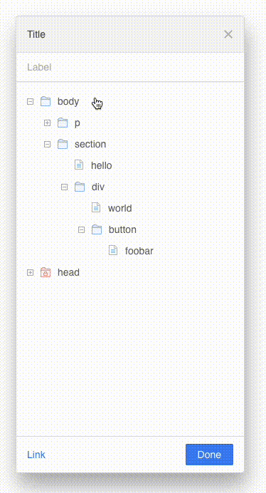

### DOM Tree as a File System



This project will represent a DOM tree as an expandable file system and:

- won't render HTML comments
- renders the head tag as a "private" red folder. This folder can still be opened.
- is built with vanilla JS and css: no build steps required

To run the project:

```bash
npm install # installs express for the static web server
npm start # run the web server
```

Then visit [http://localhost:3000/](http://localhost:3000/) (or just open `public/index.html` in a browser to avoid npm).

To test with different DOM trees, update `htmlString` in `public/index.js` to the desired HTML and refresh the page.
